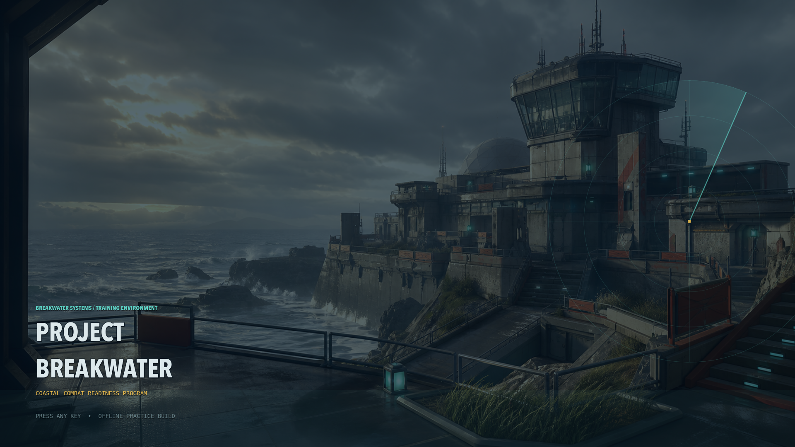

# Call of Duty Sol Ultra

> **Repository note:** “Call of Duty Sol Ultra” is the private repository label requested by the owner. The game itself is **Project Breakwater**, an original work that is not affiliated with, endorsed by, or built from the assets, code, branding, characters, maps, audio, or UI of Call of Duty or Activision.

Project Breakwater is a complete offline Godot 4.7 arena FPS: title screen, local “Practice Matchmaking” presentation, eight-combatant free-for-all with seven autonomous bots, first-to-30 victory or defeat, results, rematch, loadouts, cosmetics, persistent settings, and an original procedural coastal map called Breakwater Station.



## Quick start

Requirements: macOS, Godot 4.7.x, and a keyboard/mouse or standard gamepad. Install Godot only if it is missing:

```bash
brew install --cask godot
godot --path .
```

The normal journey is **Title → Home → Play → Practice Matchmaking → Loading → Free-for-All → Results**. Practice Matchmaking is explicitly an offline simulation; this project has no networking or remote matchmaking service.

Run the complete non-windowed release verifier with:

```bash
GODOT_BIN=/opt/homebrew/bin/godot ./scripts/verify_breakwater.sh
```

## Core controls

| Keyboard / mouse | Action | Controller |
| --- | --- | --- |
| `W A S D` / mouse | Move / look | Left / right stick |
| `Shift`, `Space`, `Ctrl` | Sprint, jump, crouch/slide | L3, A, B |
| Left / right mouse | Fire / aim | Right / left trigger |
| `R`, `E`, `V`, `1` | Reload, interact, melee, swap | X, X, R3, Y |
| `G`, `Q` | Frag / tactical grenade | RB / LB |
| `Tab`, `Esc` | Scoreboard / pause | Back / Start |

Keyboard, mouse, and controller gameplay actions can be rebound in Settings.

## High-level build rationale and process

This is the project-level design record—not private scratchpad reasoning. The build strategy was to capture the responsiveness and match readability of a modern military-arcade shooter while keeping every concrete expression original:

1. **Protect the originality boundary.** The map, weapon names, UI language, operators, camos, procedural models, effects, music, and sounds were created for Breakwater rather than copied or traced from a commercial game.
2. **Make combat data-driven.** Six weapon definitions own damage, falloff, cadence, spread, recoil, magazine, reload, reserve, and handling values. Player and bot controllers consume the same combat contracts.
3. **Finish one complete journey first.** Title-to-results flow, exact score limits, death/respawn, and autonomous scoring were established before expanding cosmetics and presentation.
4. **Treat bots as real free-for-all participants.** Bots select any opponent, traverse all three routes, use range-appropriate weapons and grenades, collect useful pickups, avoid unsafe spawns, and continue fighting when the player is idle.
5. **Use original procedural production assets.** Breakwater Station, weapons, operators, VFX, ambience, music, and gameplay cues are generated from GDScript geometry, materials, and synthesis. The generated menu image is documented in `ATTRIBUTIONS.md`.
6. **Convert regressions into executable contracts.** Tests now cover lifecycle edges such as winning shots inside physics callbacks, grenade final kills, reload interruption, GUI-owned controller input, rematch HUD cleanup, real bot-vs-bot telemetry, input rebinding, settings application, export contents, signing, and archived-app startup.

The strongest engineering lesson was that presentation and correctness meet at lifecycle boundaries. A match can finish inside a weapon or grenade callback; a persistent HUD can carry stale state into a rematch; and a broad bot score is not sufficient proof that bots fought one another. Those cases now have explicit guards and regression tests.

## Time invested

The tracked Codex build goal recorded **11,465 seconds (3 hours, 11 minutes, 5 seconds)** of active building and verification through the main release-hardening milestone. The four primary playable-to-hardened milestones spanned **2 hours, 31 minutes, 35 seconds** by commit timestamps. The final documentation, additional audit fixes, and private-GitHub publication happened afterward and are not included in the 11,465-second measurement.

These are tooling/goal and commit-window measurements, not an estimate of how long a human studio production would take.

## Verification snapshot

Verified headlessly on an Apple M5 Mac with Godot 4.7.1:

- Godot import and GDScript parsing: pass
- Gameplay suite: **215 assertions**
- Integration suite: **278 assertions**
- Combined automated coverage: **493 assertions**
- Unattended 300-second simulation: **265 bot eliminations**, including **246 genuine bot-vs-bot** and 19 bot-vs-player eliminations, 14 bot grenades, 19 pickups, and one completed first-to-30 round
- Scoped exported-PCK allowlist: **81 Breakwater-only files**
- Universal macOS export: arm64 and x86_64
- Ad-hoc signing, strict verification, ZIP extraction, and extracted signature/architecture checks: pass
- Archived executable 60-second simulation: 52 bot eliminations, including 51 bot-vs-bot eliminations, 3 grenades, and 5 pickups
- Separate accelerated five-minute logic simulation: **0.94 seconds wall time** and about **312 MB maximum RSS**

The verifier creates `build/Project Breakwater-macOS.zip`, but build output is deliberately ignored by Git.

## Repository map

| Path | Purpose |
| --- | --- |
| `project.godot`, `scenes/main.tscn` | Godot 4.7 project and boot scene |
| `src/gameplay/` | Weapons, player, bots, damage, scoring, pickups, grenades |
| `src/game/` | Match composition, HUD telemetry, results, viewmodel |
| `src/world/` | Procedural Breakwater Station and bot route graph |
| `src/ui/` | Menus, settings, HUD, matchmaking presentation, results |
| `src/audio/`, `src/vfx/` | Original synthesized audio and procedural effects |
| `tests/` | Gameplay and end-to-end integration suites |
| `scripts/verify_breakwater.sh` | Full headless test/export/sign/archive verification |

## Original `/goal` build prompt

Preserved verbatim for the studio build video and future reference.

<details>
<summary>Expand the original Project Breakwater prompt</summary>

```text
/goal Build and finish “Project Breakwater,” an original, polished offline 3D arena FPS in this existing empty Git repository using Godot 4.7 and GDScript. If Godot is missing, install it with `brew install --cask godot`. Target macOS on this Apple M5 Mac, supporting keyboard/mouse and controller at 1920×1080 and a stable 60 FPS.

Create a complete player journey: title screen → main menu → Play → convincing “Practice Matchmaking” search/found/loading sequence → 8-combatant free-for-all with the player and 7 bots → victory or defeat when anyone reaches 30 kills → results, rematch, or return to menu. Clearly identify matchmaking as an offline simulation; do not implement networking.

GAMEPLAY
- Deliver responsive modern military-arcade FPS movement and weapon handling: movement, sprint, jump, crouch, slide, aim-down-sights, hip fire, recoil, reload, melee, weapon swapping/pickups, and grenade throwing.
- Create six distinct original weapons: assault rifle, SMG, pump shotgun, DMR, LMG, and pistol. Balance damage, range, fire rate, spread, recoil, magazines, reloads, and pickups.
- Include headshots, damage falloff, regenerating health, hit/kill markers, muzzle flashes, impacts, audio, ammo management, death, respawning, spawn protection, and satisfying camera/weapon feedback.
- Add frag, flash, and concussion grenades that visibly affect players and AI.
- Add selectable loadouts, 3 original player skins, and 3 visibly different weapon camos.
- Build a complete HUD with health/damage feedback, ammo, equipment, crosshair, minimap/compass, kill feed, leader, score-to-30, scoreboard, and pause menu.

BOTS AND MATCH
Bots must navigate, patrol, perceive and select any opponent, fight both the player and one another, use different weapons and grenades, collect pickups, respawn, and avoid unsafe spawns. They must keep fighting and scoring if the player remains idle. The player wins at exactly 30 kills; if a bot reaches 30 first, show defeat.

MAP
Build one polished original map called “Breakwater Station”: a sunlit near-future coastal research base designed for 8-player FFA. Include three interconnected combat routes, interiors and exteriors, vertical flanks, cover, recognizable landmarks, safe spawn zones, ocean views, vegetation, atmospheric fog, reflections, strong lighting, and optimization. Do not reproduce any existing Call of Duty map.

MENUS AND SETTINGS
Implement polished home, play/matchmaking, loadout, skins, settings, controls, credits, loading, pause, and post-match screens. Settings must function, persist between launches, and include:
- Master, music, SFX, and UI volume
- Mouse, ADS, and controller sensitivity
- Controller dead zone, vibration, invert-Y, and input rebinding
- FOV, fullscreen/windowed mode, resolution scale, graphics presets, and VSync
- Camera-shake, hit-marker, and crosshair options

Use coherent original UI, music, sound effects, VFX, transitions, loading feedback, models, textures, and environmental art. Use only original, procedurally generated, AI-generated, or verified redistributable free assets. Do not copy Call of Duty branding, names, characters, maps, UI, sounds, weapon models, textures, or other protected content. Record all external assets and licenses in `ATTRIBUTIONS.md`; use no paid assets.

REPOSITORY AND ENGINEERING
Keep the existing `.git` repository; do not create a nested repository or reinitialize it. Add an appropriate `.gitignore` and a complete README covering installation, launching, controls, architecture, settings, tests, and known limitations. Use modular, data-driven Godot scenes and resources. Commit meaningful milestones and finish with a clean working tree. Work autonomously through setup, combat, bots, match rules, map, content, menus, settings, polish, and QA. Do not stop at an unpolished graybox while safe improvements remain.

DEFINITION OF DONE
- Run Godot import and script-parse checks plus automated tests for scoring, bot combat, damage/death/respawn, weapon pickups, grenades, controls, and settings persistence.
- Launch and verify the complete flow using keyboard/mouse and controller.
- Observe an unattended 5-minute match and confirm bots kill and score against one another.
- Verify player victory at 30, bot victory at 30, results, rematch, and return-to-menu behavior without errors or crashes.
- Profile at 1080p and fix material regressions until gameplay maintains a stable 60 FPS on this Mac.
- Capture screenshots of menus, the map, combat, and results.
- Finish by reporting exact run commands, test and performance results, completed features, known limitations, commit summary, and final Git status.
```

</details>

## Build notes and honest limitations

- The project favors cohesive stylized procedural geometry over external high-poly character and weapon packs.
- Automated tests dispatch the keyboard/mouse combat path and validate analog-stick, trigger, face-button, D-pad, rebinding, persistence, and dead-zone behavior. A final physical-controller right-stick comfort and vibration pass is still required.
- At the owner’s request, the latest build was not opened during final hardening. Headless logic throughput is not proof of rendered 1920×1080 at 60 FPS, and the checked-in rendered screenshots predate the latest polish.
- The verified ZIP is ad-hoc signed for local testing; it is not Developer ID-signed or notarized for public distribution.
- Practice Matchmaking is deliberately local and offline.

See [BREAKWATER.md](BREAKWATER.md) for full controls, architecture, settings, tests, export instructions, screenshot provenance, and limitations. See [ATTRIBUTIONS.md](ATTRIBUTIONS.md) for asset provenance and redistribution notes.
